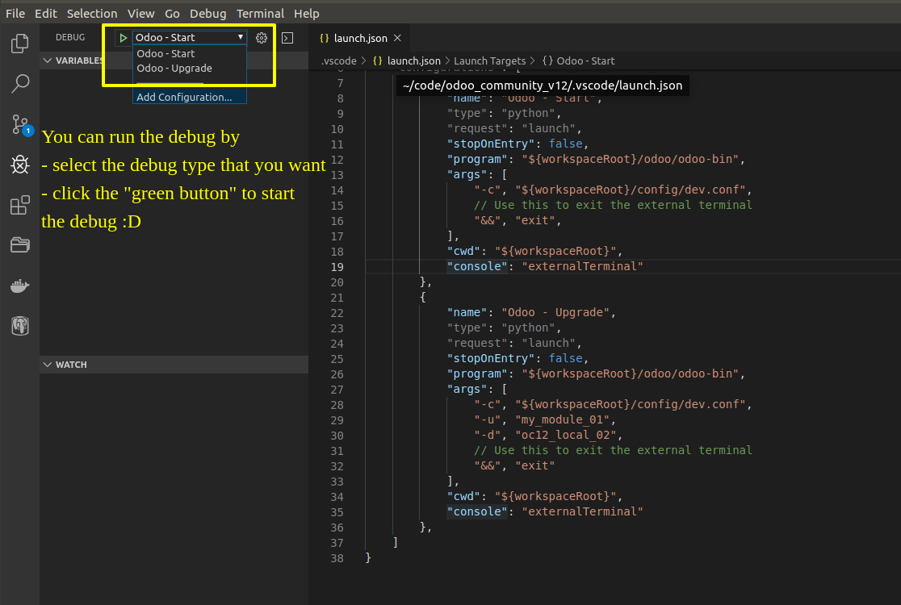
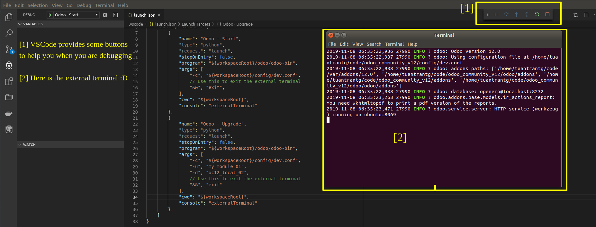

# How to Debug Odoo by VSCode

#### Please read this
- Before you read the following sections, you need a Ubuntu machine (real or virtual machine, it's up to you)
  - You can use any OS to do. But in this guide, I use the Ubuntu
- To use the VSCode to run or debug the Odoo, you need to know some things:
  - Odoo needs a environment to run -> We will use the virtual environment in [this guide](https://github.com/tuantrantg/how-to-setup-the-odoo-simple-development-envinroment/blob/master/README.md) to run Odoo by the VSCode
  - Odoo also needs a PostgreSQL server, please "google" to setup a PostgreSQL server if you don't have it on your machine
  - VSCode must be installed on your machine & you must install the ***Python (ms-python.python)*** package

#### Prepare the debug configuration
- Open your VSCode and open the Debug section


- When you create the new debug configuration, VSCode will create the new file named ***launch.json*** (this new file is in `.vscode/`) -> You must input the content to this file. Here is the sample


- In the 2nd image, we will focus ***2 important parameters***: `program` and `args`
  - `program`: This is the path of the `odoo-bin` file of Odoo. If you don't have it, you can NOT run. It's simple :D
  - `args`: This is the specical parameter
    - In this parameter, you will specify ***the Odoo config file*** to run the Odoo, if you do NOT have the Odoo config file, you must declare the Odoo arguments to in here.
    - Please notice that
      - I use `"-c"` and `"${workspaceRoot}/config/dev.conf"` to specify the Odoo config file.
      - I use `"-u"` and `"my_module_01"` to specify which module needs to upgrade
      - I use `"-d"` and `"oc12_local_02"` to specify which database needs to upgrade
      - And because I use the external terminal, so I need to use `"&&"` and `"exit"` to forced close the external terminal when I termniate the debug
- If you don't need to use the external terminal, just remove `"console": "externalTerminal"`
- Here is the sample of 2 Odoo debug configurations:

```
{
    // Use IntelliSense to learn about possible attributes.
    // Hover to view descriptions of existing attributes.
    // For more information, visit: https://go.microsoft.com/fwlink/?linkid=830387
    "version": "0.2.0",
    "configurations": [
        {
            "name": "Odoo - Start",
            "type": "python",
            "request": "launch",
            "stopOnEntry": false,
            "program": "${workspaceRoot}/odoo/odoo-bin",
            "args": [
                "-c", "${workspaceRoot}/config/dev.conf",
                // Use this to exit the external terminal
                "&&", "exit",
            ],
            "cwd": "${workspaceRoot}",
            "console": "externalTerminal"
        },
        {
            "name": "Odoo - Upgrade",
            "type": "python",
            "request": "launch",
            "stopOnEntry": false,
            "program": "${workspaceRoot}/odoo/odoo-bin",
            "args": [
                "-c", "${workspaceRoot}/config/dev.conf",
                "-u", "my_module_01",
                "-d", "oc12_local_02",
                // Use this to exit the external terminal
                "&&", "exit"
            ],
            "cwd": "${workspaceRoot}",
            "console": "externalTerminal"
        },
    ]
}
```

#### It's time to DEBUGGGGGGGG!!!
- After you save the ***launch.json*** file. you can debug right now :3





#### Author's notes
A ***special thanks*** goes to ***Nguyen Van Nam - NamNV (namnguyenthieniris@gmail.com)*** who supports me to build the debug configuration in the first step :D
